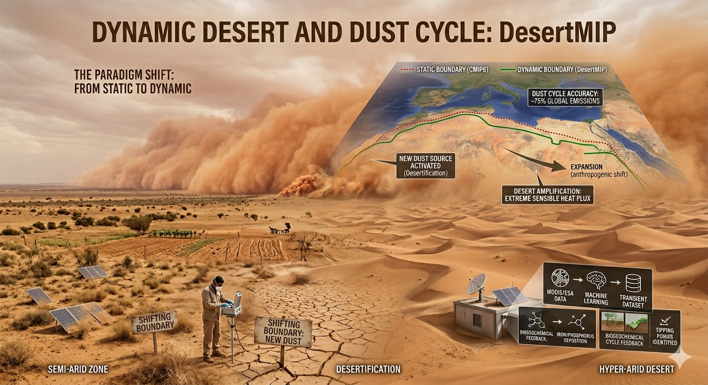

# 🔭 Scientific Overview

## 🔄 The Paradigm Shift: Transient Surface Parametrization
Conventional Earth System Modeling (ESM) paradigms within previous intercomparison frameworks have traditionally relied on constrained boundary approximations for arid ecosystems, often homogenizing transient geomorphological transitions. While these simplifications provided computational stability in earlier modeling eras, they represent a critical limitation in resolving contemporary and future climate-land interactions.

To address the non-linear morphological evolutions driven by compound forcing agents, DesertMIP proposes an advanced spatiotemporal framework. This approach integrates transient surface state variability, facilitating a more nuanced representation of arid and semi-arid continual fluxes without prescribing rigid threshold definitions prior to rigorous multi-model synthesis.

## 🎯 Why DesertMIP Matters
The re-evaluation of surface boundary dynamics addresses several fundamental complexities in current Earth System forecasting:

* **Aerosol Precursor Morphologies:** Refining the spatiotemporal activation parameters of mineral aerosols by addressing the latent geomorphological shifts that precursor domains undergo under perturbed radiative forcing.
* **Thermodynamic Flux Modulations:** Re-evaluating the regional energy partitioning and sensible heat amplifications inherent to transitional land-surface states, which inherently govern broader atmospheric teleconnections and structural circulations.
* **Coupled Biogeochemical Pathways:** Investigating the cascading dependencies within earth system cycles, specifically how modified fractional parametrizations influence distant biogeochemical sink dynamics.
* **Non-linear State Transitions:** Exploring the resilience and bistability of hydro-climatic regimes to identify latent thresholds dictating systemic shifts in localized surface-atmosphere interactions.

## 🛠️ Methodological Framework
DesertMIP employs a multi-tiered data synthesis strategy, integrating multidimensional observational proxies with advanced computational heuristics. This synergistic approach facilitates the generation of harmonized, transient boundary conditions—abstracting the underlying fractional surface parameters—designed to be seamlessly integrated into forthcoming Tier-1 and Tier-2 experimental protocols across participating modeling centers.

