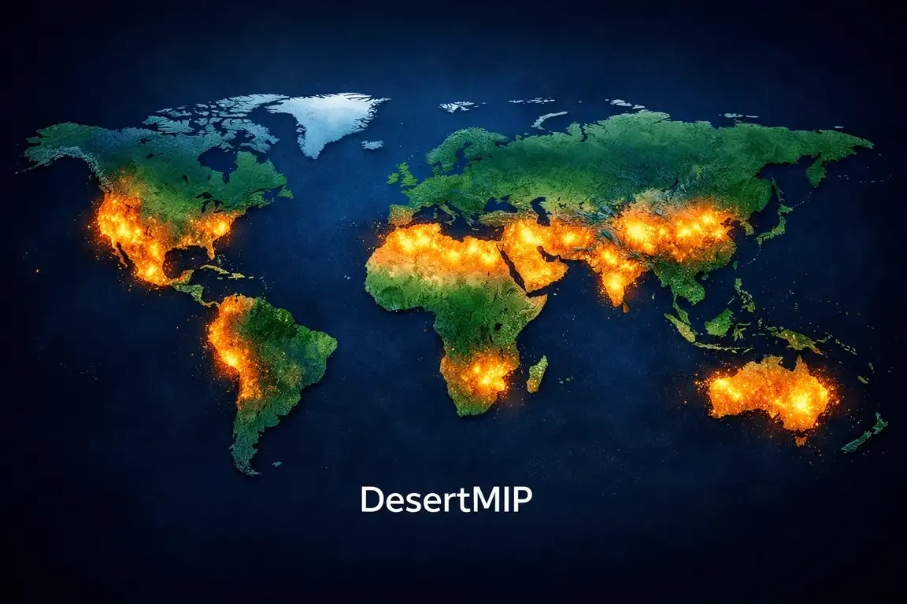

## 🌍 Desertification Model Intercomparison Project
**A MIP registered with the WCRP-CMIP7 framework**

---

  

## 🏜️ About DesertMIP

Deserts are the primary natural source of atmospheric mineral dust, accounting for ~75% of global aerosols, and exhibit extreme climate sensitivity ("desert amplification"). However, current Earth System Models (ESMs) within the Coupled Model Intercomparison Project (CMIP) framework typically rely on static desert masks. 

In an era of rapid climate shifts, this critical limitation obscures potential Earth system tipping points and induces systematic biases in dust emission simulations (up to 100%) and regional warming projections. **DesertMIP** is designed to address this gap by providing the first multi-model assessment of *dynamic* desert boundaries and their cascading dust-climate-ecosystem feedbacks in CMIP7-class models.

## 🎯 Core Scientific Objectives
By introducing satellite-derived dynamic desert fractions as a novel forcing, DesertMIP focuses on three primary pillars:

1. **Global Dynamics & Tipping Points:** Systematically mapping and tracking dynamic shifts in global desert boundaries and semi-arid transition zones using high-resolution observational data (e.g., ESA WorldCover 2020), identifying critical thresholds for desertification.
2. **Automated Predictive Modeling (Data-Driven):** Developing a robust, machine-learning-assisted framework to automatically project future desert boundaries and spatial transitions based on specific climate change trajectories (utilizing scenarios such as SSP2-4.5).
3. **Impacts, Compound Extremes & Feedbacks:** Evaluating the cascading impacts of shifting boundaries on regional climate, atmospheric circulation, **compound climate hazards** (e.g., co-occurring extreme heatwaves and severe dust storms), and **biogeochemical feedbacks** (e.g., ocean fertilization via dust deposition).

## 🤝 Cross-MIP Synergies
DesertMIP strongly aligns with the broader CMIP7 objectives. We provide the missing dynamic boundary conditions that are essential for other MIPs, seeking synergistic collaborations to maximize data utility and reduce redundant simulations. We actively coordinate with:

* **LMIP (Land Surface, Snow and Soil Moisture MIP):** Bridging the gap in dynamic land-cover transitions, surface albedo changes, and vegetation tipping points in arid/semi-arid regions.
* **AerChemMIP (Aerosols and Chemistry MIP):** Providing realistic, time-varying mineral dust emissions to better constrain dust-radiation-cloud interactions, atmospheric chemistry, and marine biogeochemistry.

## 🚀 Project Status
* **Status:** Registered and active.
* **Current Phase:** Finalizing Tier-1 experimental design and drafting the primary Geoscientific Model Development (GMD) paper (Call for Participation).

## 👥 Steering Committee & Contact
**Lead Contact:** Marzieh Mokarram (On behalf of the DesertMIP Steering Committee)
